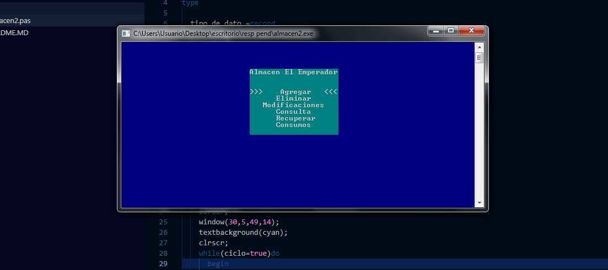
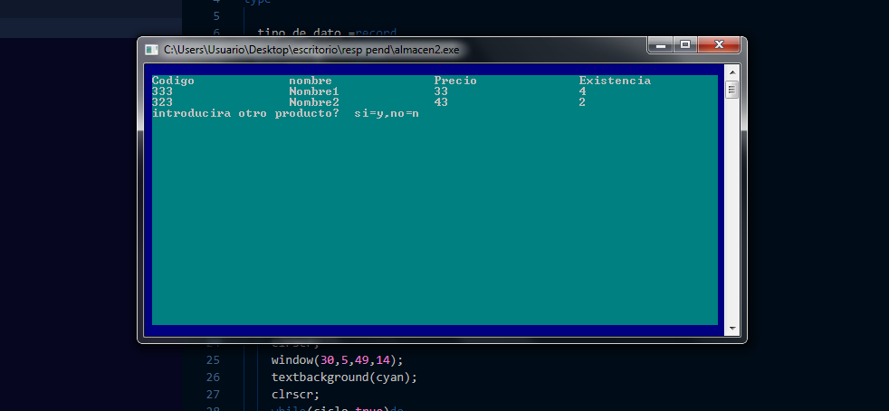
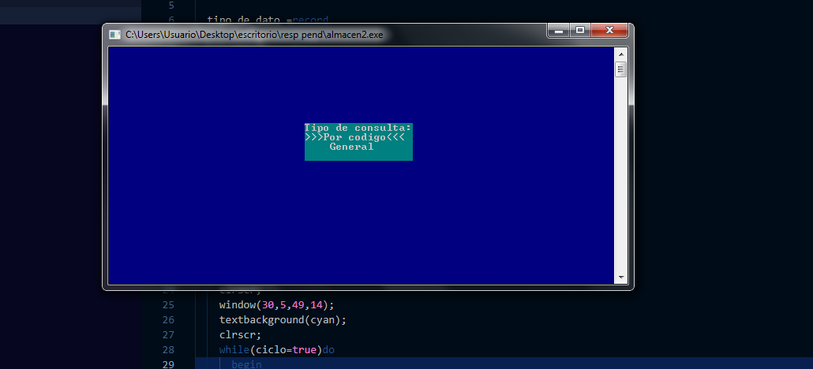
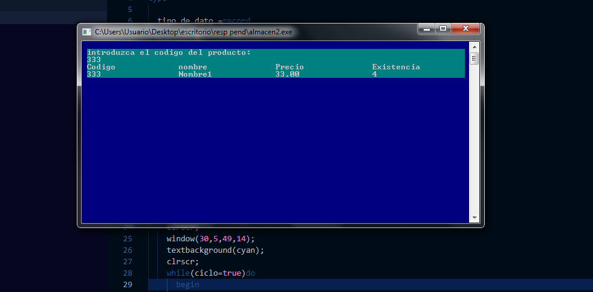
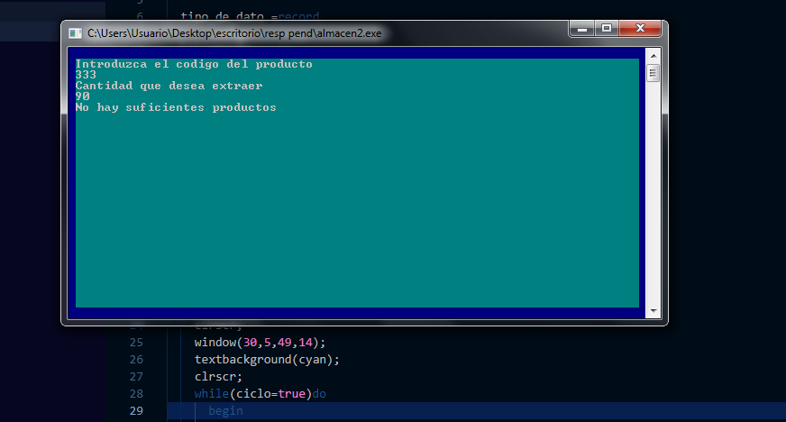

# Trabajo práctico (TP) - "Almacén el emperador"

## Visión general

Uno de los primeros lenguajes con los que comencé a programar fue PASCAL, de entre los trabajos prácticos (TP) que me asignaron en la universidad uno de los que más recuerdo fue el de un “almacén” el enunciado era sencillo (no tanto para mí en ese entonces) pero como me dieron algo de tiempo pude ponerme algo creativo con la interfaz de usuario. A pesar de que se trataba de un programa de consola le coloqué un menú que le permitía al usuario desplazarse usando los cursores del teclado, dándole un buen acabado. 

Actualmente veo el código (y la interfaz) y encuentro muchas cosas que se podrían mejorar pero con el objetivo de ver la evolución de mi propio código no lo voy a modificar. Si encuentra algo que le resulte de utilidad es completamente libre de usarlo.

## Capturas

## Enunciado del TP

Objetivo: Al finalizar este trabajo práctico el estudiante evidenciará la aprehensión de los conocimientos de manejo de arreglos y registros.-

Almacén El Emperador:

El concesionario de inversiones El Emperador del IUT, desea que el departamento de informática le desarrolle una aplicación en PASCAL que le permita el control de los productos que mantiene en su almacén.

Para ello cuenta con los siguientes datos de los productos:

	Código: 5 caracteres.
	Nombre: 20 caracteres.
	Precio:  real.
	Existencia:  entero.

Trabajo a realizar:

 a) Defina un tipo de datos (registro) que permita almacenar dichos campos.

 b) Defina un vector suficientemente grande de dichos registros.
 
 c) Escriba los subprogramas necesarios para realizar las siguientes operaciones:

	*Agregar: consiste en introducir nuevos productos con todos sus datos.
	
	*Eliminar: consiste en eliminar “lógicamente” un producto.

	*Modificaciones: se introduce el código del producto, se muestra y se piden todos sus datos.

	*Consultas: Pueden ser de dos tipos, por producto pidiendo el código y mostrando todos sus datos; general, mostrando el listado de todos los productos con sus datos.

	*Recuperar: Permite recuperar un producto previamente eliminado.

	*Consumos: consiste en introducir el gasto realizado por producto para un menú.

Escriba un programa comandado por un menú con las operaciones del apartado anterior.

	Deberá tener en cuenta lo siguiente:

	*Elaborar el programa haciendo uso de procedimientos y funciones.

	*Los consumos no deben ser mayores a las cantidades existentes.

